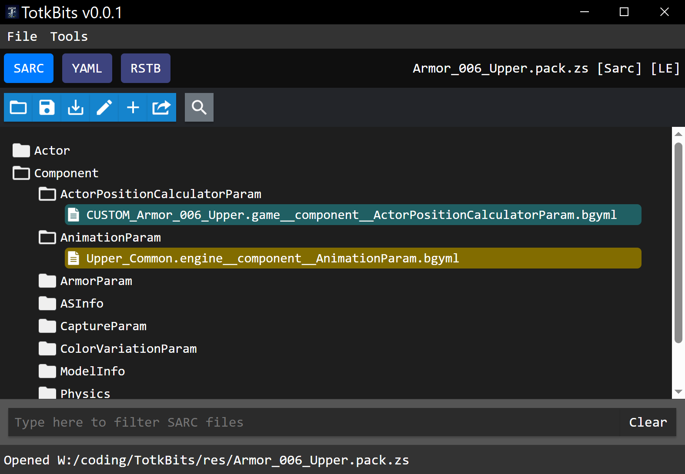
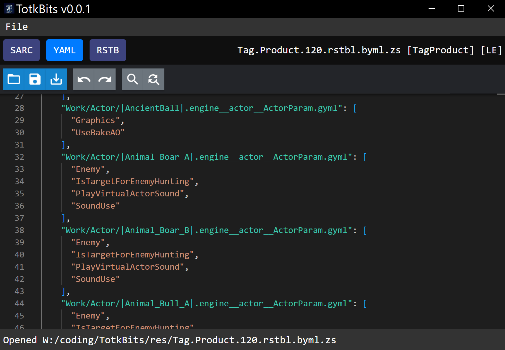

# TotkBits
TotkBits is a custom TOTK file editor project, similar to [WildBits](https://github.com/NiceneNerd/Wild-Bits). It is developed in Rust, and the GUI is implemented using React. Currently, some file formats are parsed using Python, but this is a temporary solution until the functionality is fully rewritten in Rust.

## Features
This tool includes most functionalities found in the NX Editor and introduces additional features:
- Comparing totk files with clean versions from dumped romfs
- Filtering SARC contents.
- Highlighting added and modded SARC entries. 
- Searching for specific text queries within the entire SARC archive.
- Supporting additional formats: ASB, AINB, Tag.Product, etc. 
- Drag-and-drop: simply drag the file into the window area to open it (dragging multiple files will open only the first one).

## Zstd
All `*.zs` files are automatically compressed or decompressed. If you wish to save the file without compression, click `Save as`, then simply remove the `.zs` extension from the file path.

# Supported Formats
- Super Mario Odyssey save files
- ASB
- AINB
- Tag.Product
- BYML
- SARC
- AAMP
- MSBT
- RESTBL (RSTB)
- BFEVL (events)
- esetb.byml + PTCL 
- JSON/YAML and other plaintext formats

To save the file as plaintext, click `Save as` and choose one of the extensions: json, yaml, yml, txt.

# Build requirements

- [LLVM](https://github.com/llvm/llvm-project/releases)
- [vite](https://vitejs.dev/guide/) (`npm install -g vite`)
- [Cmake](https://cmake.org/download/) 

# Keyboard Shortcuts

- `Ctrl+S`: Save the file. This function applies to the SARC, YAML, or RSTB tabs, depending on which is active.
- `Ctrl+O`: Open a file.
- `Ctrl+E`: Extract a file. This function is only available in the SARC tab and when a file is selected.

### Additional Shortcuts for the YAML Editor

The YAML editor uses the Monaco editor from Visual Studio Code, which includes all standard shortcuts:
- `Ctrl+Z` / `Ctrl+Shift+Z`: Undo/Redo an action.
- `Ctrl+H`: Replace text.

# Contributors
- [Arch Leaders](https://github.com/ArchLeaders): BfevLibrary
- [NiceneNerd](https://github.com/NiceneNerd): Contributions to [roead](https://github.com/NiceneNerd/roead), part of the [msbt](https://github.com/NiceneNerd/msyt) library (used only for Big Endian msbt), and the [RESTBL library](https://github.com/NiceneNerd/restbl).
- [jordanbtucker](https://github.com/jordanbtucker) and [Arch Leaders](https://github.com/ArchLeaders): Development of the [msbt C++ library](https://github.com/EPD-Libraries/msbt) (used for Little Endian msbt).
- [dt-12345](https://github.com/dt-12345): Development of [AINB](https://github.com/dt-12345/ainb.git) and [ASB](https://github.com/dt-12345/asb.git) parsers.
- [Winpython Team](https://github.com/winpython): The latest release includes [Winpython v3.11.8](https://github.com/winpython/winpython/releases/tag/7.1.20240203final), which supports ASB and AINB parsing.

# Known Issues
- .szs files can be edited and saved, but for some reason, games like Super Mario Odyssey won't boot with these files (due to an issue with roead::Yaz0::compress). Reopening the file in Switch Toolbox and saving it again resolves this issue.
- LayoutMsg/CtrlGuide_00.msbt can be previewed but it CANNOT BE EDITED at the moment
